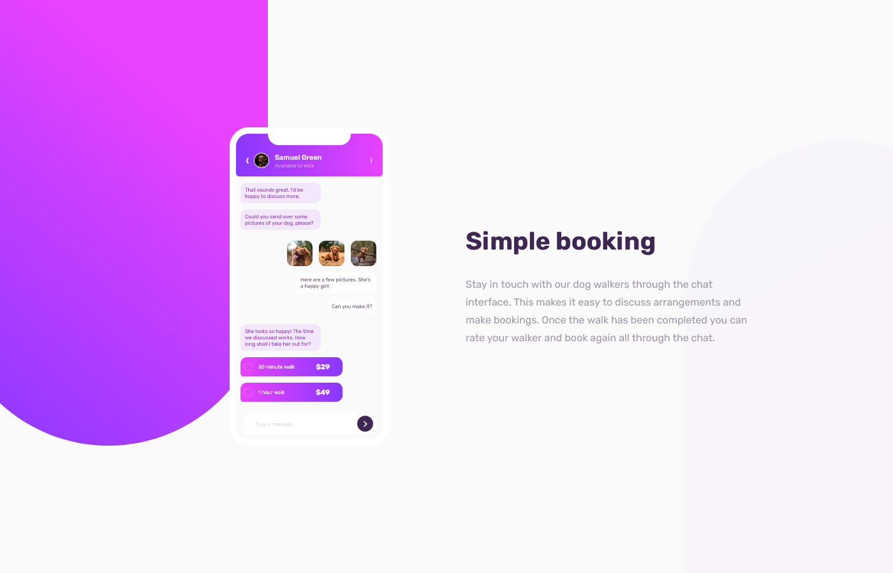
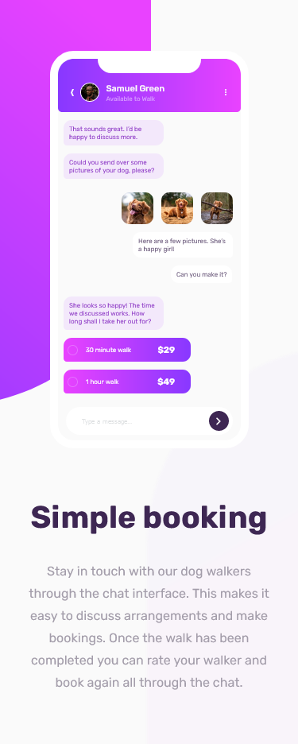

# Frontend Mentor - Chat app CSS illustration solution

This is a solution to the [Chat app CSS illustration challenge on Frontend Mentor](https://www.frontendmentor.io/challenges/chat-app-css-illustration-O5auMkFqY). Frontend Mentor challenges help you improve your coding skills by building realistic projects. 

## Table of contents

- [Overview](#overview)
  - [The challenge](#the-challenge)
  - [Screenshot](#screenshot)
  - [Links](#links)
- [My process](#my-process)
  - [Built with](#built-with)
  - [What I learned](#what-i-learned)
- [Author](#author)

## Overview

### The challenge

Users should be able to:

- View the optimal layout for the component depending on their device's screen size
- **Bonus**: See the chat interface animate on the initial load

### Screenshot

### Links

- Solution URL: [Github](https://github.com/amberseas/FrontendMentorChallenges/tree/chat-app)
- Live Site URL: [Netlify](https://amberseas-chat-app.netlify.app/)

## My process

### Built with

- Semantic HTML5 markup
- Sass/SCSS
- Flexbox
- Mobile-first workflow

### What I learned

I had a lot of fun working on this project. It's a small project, but it defenitely improved my CSS positioning and animation skills.

## Author

- Website - [Gintarė Šimkūnienė](https://amberseas.netlify.app)
- Frontend Mentor - [@amberseas](https://www.frontendmentor.io/profile/amberseas)
- LinkedIn - [Gintarė Šimkūnienė](https://www.linkedin.com/in/gintar%C4%97-%C5%A1imk%C5%ABnien%C4%97/)

