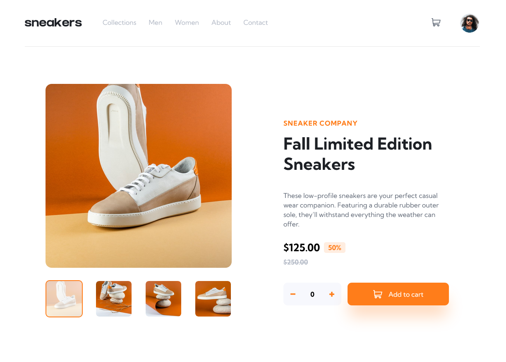
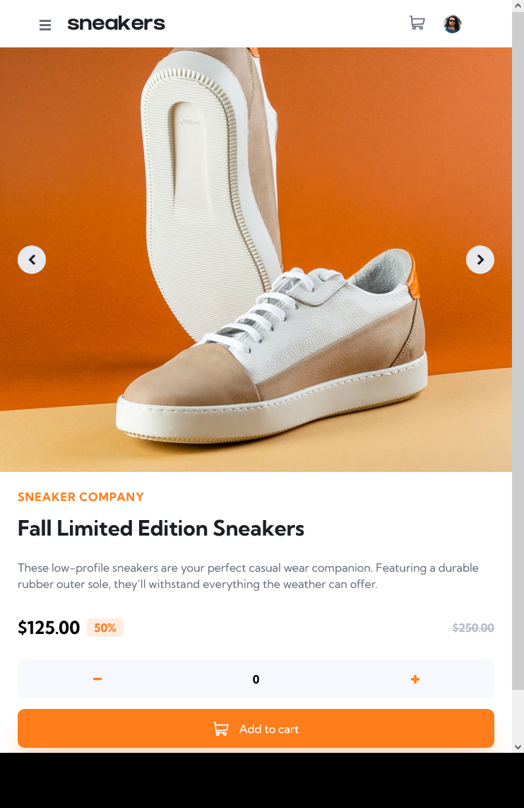
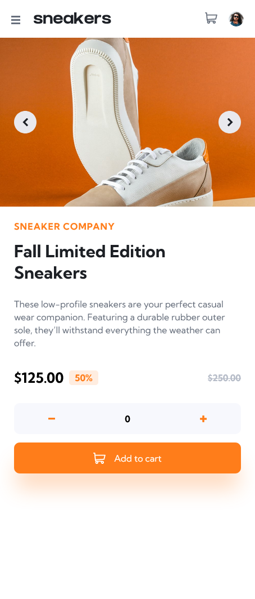

# Frontend Mentor - E-commerce product page solution

This is a solution to the [E-commerce product page challenge on Frontend Mentor](https://www.frontendmentor.io/challenges/ecommerce-product-page-UPsZ9MJp6). Frontend Mentor challenges help you improve your coding skills by building realistic projects.

## Table of contents

- [Overview](#overview)
  - [The challenge](#the-challenge)
  - [Screenshot](#screenshot)
  - [Links](#links)
- [My process](#my-process)
  - [Built with](#built-with)
  - [What I learned](#what-i-learned)
  - [Continued development](#continued-development)
- [Author](#author)


## Overview

### The challenge

Users should be able to:

- View the optimal layout for the site depending on their device's screen size
- See hover states for all interactive elements on the page
- Open a lightbox gallery by clicking on the large product image
- Switch the large product image by clicking on the small thumbnail images
- Add items to the cart
- View the cart and remove items from it

### Screenshot





### Links

- Solution URL: [Github](https://github.com/amberseas/FrontendMentorChallenges/tree/E-commerce)
- Live Site URL: [Netlify](amberseas-ecommerce.netlify.app)

## My process

### Built with

- Semantic HTML5 markup
- Sass
- Flexbox
- CSS Grid
- Desktop-first workflow
- [Angular](https://angular.io/start) - development platform
- [TypeScript](https://www.typescriptlang.org/)
- ESLint with rules AirBnB

### What I learned

This project helped me practice building Angular app, using services for communication between components. It took me around 10h of non-intence work.
I also learned how to change colors of svg icons.

To see how you can add code snippets, see below:

```css
.empty-cart {
  cursor: pointer;

  &:hover svg path {
    fill: $dark-grayish-blue;
  }
}
```

### Continued development

in future I want to continue focusing more on logic of websites (JavaScript)

## Author

- Website - [Gintarė Šimkūnienė](https://amberseas.netlify.app)
- Frontend Mentor - [@amberseas](https://www.frontendmentor.io/profile/amberseas)
- LinkedIn - [Gintarė Šimkūnienė](https://www.linkedin.com/in/gintar%C4%97-%C5%A1imk%C5%ABnien%C4%97/)